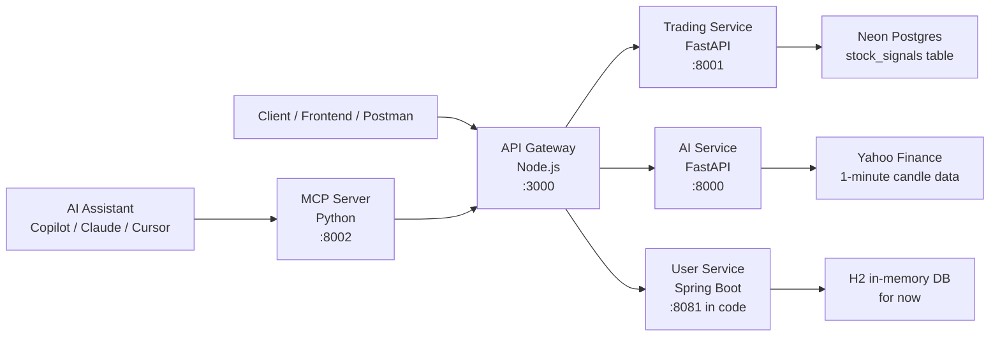

# MyInvestAppAPI Project Overview

## What This Project Is

`MyInvestAppAPI` is a microservices-based backend for a trading and investment application.

It combines:

- a Node.js API gateway,
- a Java user service,
- a Python trading service,
- a Python AI prediction service,
- and an MCP server that exposes the platform as tools for AI assistants.

The long-term idea is to support both normal app clients and AI-driven workflows for trading, stock analysis, and portfolio access.

## High-Level Architecture

## Services

### 1. API Gateway

Path: [api-gateway-node/index.js](/Users/rakeshkumarkathoju/Documents/GitHub/MyInvestAppAPI/api-gateway-node/index.js:1)

Purpose:

- acts as the single entry point for clients,
- forwards requests to the trading, AI, and user services,
- exposes a combined `/health` endpoint.

Current routes:

- `GET /stocks`
- `POST /trade`
- `POST /ai/train`
- `POST /ai/predict`
- `POST /users/register`
- `POST /users/login`
- `GET /users/:id`
- `GET /users/:id/portfolio`
- `GET /health`

What it currently does:

- mostly request forwarding and error wrapping,
- little business logic,
- no authentication or authorization layer yet.

### 2. Trading Service

Path: [trading-service-python/main.py](/Users/rakeshkumarkathoju/Documents/GitHub/MyInvestAppAPI/trading-service-python/main.py:1)

Purpose:

- connects to Postgres/Neon,
- reads stock signals,
- inserts trade records.

Current routes:

- `GET /`
- `GET /health`
- `GET /stocks`
- `POST /trade`

What it currently does:

- opens a database connection using `DATABASE_URL`,
- reads from the `stock_signals` table,
- inserts new rows into `stock_signals`.

Important note:

The trading service is currently more like a data-access service than a full trading engine. Files for strategy and live/paper trading exist, but several are still empty:

- [trading-service-python/strategy.py](/Users/rakeshkumarkathoju/Documents/GitHub/MyInvestAppAPI/trading-service-python/strategy.py:1)
- [trading-service-python/indicators.py](/Users/rakeshkumarkathoju/Documents/GitHub/MyInvestAppAPI/trading-service-python/indicators.py:1)
- [trading-service-python/paper_trade.py](/Users/rakeshkumarkathoju/Documents/GitHub/MyInvestAppAPI/trading-service-python/paper_trade.py:1)
- [trading-service-python/live_trade.py](/Users/rakeshkumarkathoju/Documents/GitHub/MyInvestAppAPI/trading-service-python/live_trade.py:1)

There is also a separate backtesting script:

- [trading-service-python/backtest.py](/Users/rakeshkumarkathoju/Documents/GitHub/MyInvestAppAPI/trading-service-python/backtest.py:1)

And a data download helper:

- [trading-service-python/download_data.py](/Users/rakeshkumarkathoju/Documents/GitHub/MyInvestAppAPI/trading-service-python/download_data.py:1)

### 3. AI Service

Path: [ai-service-python/main.py](/Users/rakeshkumarkathoju/Documents/GitHub/MyInvestAppAPI/ai-service-python/main.py:1)

Purpose:

- trains an ML model on market candle data,
- predicts trading signals for a ticker.

Current routes:

- `GET /health`
- `POST /train`
- `POST /predict`

How it works:

- downloads 1-minute candle data from Yahoo Finance,
- computes technical features such as VWAP gap, EMA ratio, RSI, ATR, volume ratio, and momentum,
- creates labels based on whether price rises by a target percentage over the next few bars,
- trains a Random Forest classifier,
- saves the model to `model.joblib`,
- returns `BUY` or `HOLD` based on the predicted probability.

This is the most advanced part of the repo from a logic perspective.

### 4. User Service

Paths:

- [user-service-java/src/main/java/com/example/userservice/UserController.java](/Users/rakeshkumarkathoju/Documents/GitHub/MyInvestAppAPI/user-service-java/src/main/java/com/example/userservice/UserController.java:1)
- [user-service-java/src/main/java/com/example/userservice/UserService.java](/Users/rakeshkumarkathoju/Documents/GitHub/MyInvestAppAPI/user-service-java/src/main/java/com/example/userservice/UserService.java:1)
- [user-service-java/src/main/resources/application.properties](/Users/rakeshkumarkathoju/Documents/GitHub/MyInvestAppAPI/user-service-java/src/main/resources/application.properties:1)

Purpose:

- manages user accounts,
- supports registration and login,
- provides profile and placeholder portfolio endpoints.

Current routes:

- `GET /users/health`
- `POST /users/register`
- `POST /users/login`
- `GET /users/{id}`
- `GET /users/{id}/portfolio`

What it currently does:

- stores users through Spring Data JPA,
- uses an H2 in-memory database for development,
- hashes passwords with SHA-256,
- returns user info after registration or login.

Important note:

`/users/{id}/portfolio` is still a stub and does not yet fetch real trade or holdings data from the trading service.

### 5. MCP Server

Path: [mcp-server/main.py](/Users/rakeshkumarkathoju/Documents/GitHub/MyInvestAppAPI/mcp-server/main.py:1)

Purpose:

- exposes your app as MCP tools for AI assistants,
- lets AI agents query stocks, place trades, train the model, and access users through a tool interface.

Current tools:

- `check_health`
- `get_stocks`
- `place_trade`
- `get_ai_prediction`
- `train_ai_model`
- `get_user`
- `get_user_portfolio`

Why this matters:

This is what makes the project more than a normal backend. It gives LLM-based tools a structured way to interact with your platform.

## Main Request Flows

### Stock List Flow

1. Client calls `GET /stocks` on the API gateway.
2. Gateway forwards the request to the trading service.
3. Trading service queries `stock_signals` from Postgres.
4. Trading service returns JSON rows.
5. Gateway returns the response to the client.

### Trade Placement Flow

1. Client calls `POST /trade` on the API gateway.
2. Gateway forwards the payload to the trading service.
3. Trading service inserts a new row into `stock_signals`.
4. Inserted record ID is returned to the client.

### AI Training Flow

1. Client calls `POST /ai/train` on the gateway.
2. Gateway forwards the request to the AI service.
3. AI service downloads recent Yahoo Finance 1-minute data.
4. AI service builds features and labels.
5. AI service trains a Random Forest model.
6. Model is saved to disk and training metrics are returned.

### AI Prediction Flow

1. Client calls `POST /ai/predict`.
2. Gateway forwards the request to the AI service.
3. AI service loads fresh market data or uses provided features.
4. AI service computes feature values.
5. AI service returns a `BUY` or `HOLD` signal and probability.

### User Flow

1. Client calls `/users/register`, `/users/login`, or `/users/{id}` on the gateway.
2. Gateway forwards the request to the Java user service.
3. User service reads or writes user data in H2.
4. User profile information is returned.

### MCP Tool Flow

1. An AI assistant calls an MCP tool such as `get_stocks`.
2. MCP server translates that tool call into an HTTP request to the API gateway.
3. The gateway routes it to the correct internal service.
4. The final result is returned back through MCP to the AI assistant.

## What Stage The Project Is In

This project is currently in a prototype or foundation stage.

What is already working:

- service separation,
- Docker composition,
- gateway routing,
- basic user registration/login,
- database-backed stock/trade storage,
- AI model training and prediction,
- MCP exposure for AI assistants.

What is still incomplete or early-stage:

- real portfolio integration,
- strategy engine implementation,
- paper trading logic,
- live trading logic,
- production-grade security,
- validation and testing depth,
- consistent configuration across services.

## Current Gaps And Risks

### 1. Port mismatch

There is a configuration mismatch for the user service:

- Docker exposes `8080:8080` in [docker-compose.yml](/Users/rakeshkumarkathoju/Documents/GitHub/MyInvestAppAPI/docker-compose.yml:45)
- Spring Boot is configured for `8081` in [application.properties](/Users/rakeshkumarkathoju/Documents/GitHub/MyInvestAppAPI/user-service-java/src/main/resources/application.properties:1)
- the gateway default points to `8080`, but the `.env` uses `8081`

This can cause failed service communication.

### 2. Health check mismatch

The gateway checks the user service at `/health`, but the user service exposes `/users/health`.

This means the gateway health report can incorrectly show the user service as disconnected.

### 3. Credentials exposure

A real Neon/Postgres connection string appears in:

- [trading-service-python/README.md](/Users/rakeshkumarkathoju/Documents/GitHub/MyInvestAppAPI/trading-service-python/README.md:1)

This should be rotated and removed from tracked documentation.

### 4. Weak password approach for production

The Java user service currently uses SHA-256 hashing. That is acceptable for learning or prototype work, but production should use BCrypt or another password hashing strategy designed for credentials.

### 5. Trading logic not fully integrated

The repository includes backtesting and data download scripts, but the runtime trading service is not yet using those strategy components directly.

## Recommended Next Steps

### Near term

- standardize ports across Docker, environment files, and code defaults,
- fix the gateway user-service health check path,
- rotate any exposed database credentials,
- connect user portfolios to actual trading data,
- add request validation to the trading service,
- clean and update the root README.

### Medium term

- implement shared indicators and strategy modules,
- move AI feature logic into reusable code,
- add tests for gateway, AI, and user service flows,
- add schema/migration management for the trading database,
- replace SHA-256 password hashing with BCrypt.

### Longer term

- implement paper trading,
- implement live trading,
- add authentication and authorization,
- add observability and better error reporting,
- define a clearer domain model for users, trades, holdings, and signals.

## Bottom-Line Summary

You are building an AI-enabled trading platform backend.

More specifically, you are creating a system where:

- users can register and log in,
- trades and stock signals can be stored in a database,
- an AI model can train on market data and predict trading opportunities,
- and AI assistants can interact with the platform through MCP tools.

The architecture is solid for a prototype, and the project already shows the shape of a larger platform. The main work left is turning the current scaffold into a more integrated and production-ready system.
