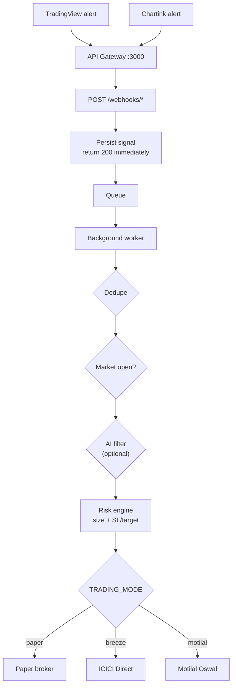

# Signal-Driven Trading: Chartink / TradingView → Paper → Live

This service turns Chartink and TradingView alerts into trades. It runs in
**paper mode by default** and switches to ICICI Direct or Motilal Oswal through
a single environment variable — no code changes.

## Flow



Webhooks **accept and queue**, they never place orders inline. TradingView
times out quickly and one Chartink alert can carry dozens of stocks, so any
per-order price lookup on the request thread would drop signals.

## Setup

```bash
cp trading-service-python/.env.example trading-service-python/.env
# set DATABASE_URL and WEBHOOK_SECRET, keep TRADING_MODE=paper
docker compose up --build api-gateway trading-service ai-service
```

Tables (`trade_signals`, `paper_orders`, `paper_positions`) are created
automatically on startup.

## Wiring up the alert sources

Point both providers at the **gateway**, not the trading service directly.

### TradingView

Webhook URL: `https://<your-host>/webhooks/tradingview`

Alert message:

```json
{
  "secret": "your-WEBHOOK_SECRET",
  "symbol": "{{ticker}}",
  "action": "{{strategy.order.action}}",
  "price": "{{close}}",
  "stop_loss": "",
  "target": "",
  "quantity": "{{strategy.order.contracts}}",
  "strategy": "{{strategy.order.id}}"
}
```

Plain text also works: `BUY RELIANCE 2950`. Leave fields blank and the risk
engine fills them in.

### Chartink

Webhook URL: `https://<your-host>/webhooks/chartink`

Chartink posts its own format and one alert carries many stocks:

```json
{
  "stocks": "SBIN,TATAMOTORS",
  "trigger_prices": "542.5,415.3",
  "scan_name": "Intraday breakout"
}
```

Chartink alerts carry **no direction** — they default to `BUY`. Wire a bearish
scan to a separate alert that includes `"action": "SELL"`.

Since Chartink cannot send the secret in a header, append it to the URL:
`https://<your-host>/webhooks/chartink?secret=your-WEBHOOK_SECRET`.

### Chartink screener on demand

```bash
curl -X POST localhost:3000/chartink/scan \
  -H 'Content-Type: application/json' \
  -d '{"scan_clause":"( {cash} ( latest close > latest ema( latest close , 20 ) ) )","execute":false}'
```

`execute: false` previews the matches; `true` trades them.

## Endpoints

| Method | Path | Purpose |
|---|---|---|
| POST | `/webhooks/tradingview` | TradingView alert intake |
| POST | `/webhooks/chartink` | Chartink alert intake |
| POST | `/chartink/scan` | Run a screener clause on demand |
| POST | `/signals/manual` | Push a hand-made signal through the engine |
| GET | `/signals` | Signal history with status and reject reasons |
| GET | `/engine/status` | Mode, broker health, risk settings, queue depth |
| GET | `/paper/positions` | Open and closed positions |
| GET | `/paper/pnl` | Realized/unrealized P&L, equity, win rate |
| GET | `/paper/orders` | Order log |
| POST | `/paper/square-off` | Exit one position or all (`{"symbol","price"}`) |
| POST | `/paper/reset` | Wipe paper state and start fresh |
| GET | `/quote/{symbol}` | Current LTP |

## How a signal becomes an order

1. **Dedupe** — same symbol+action inside `SIGNAL_DEDUPE_SECONDS` is dropped.
   Chartink and TradingView both re-fire on the same candle.
2. **Market hours** — rejected outside `MARKET_OPEN`–`MARKET_CLOSE` on weekdays.
3. **AI filter** (optional) — `AI_CONFIRMATION_ENABLED=true` asks the AI service
   to confirm BUYs. **Exits are never blocked**; refusing to close a position is
   more dangerous than refusing to open one. If the AI service is down,
   `AI_FAIL_OPEN` decides whether trades pass through.
4. **Exit detection** — a SELL on a held long squares off exactly the held
   quantity rather than sizing a new position.
5. **Sizing** — quantity from the signal wins. Otherwise:
   - with a stop-loss: `(capital × RISK_PER_TRADE_PCT%) ÷ (entry − stop)`
   - always capped by `MAX_POSITION_PCT` of available capital
   - blocked by `MAX_OPEN_POSITIONS`
6. **Fill** — paper fills apply `SLIPPAGE_PCT` and `BROKERAGE_PCT` so results
   are not optimistic.

Every rejection is stored with its reason — check `GET /signals`.

## Going live

Only after your paper P&L is genuinely positive over a meaningful sample.

```env
# ICICI Direct — BREEZE_SESSION_TOKEN must be regenerated daily
TRADING_MODE=breeze
BREEZE_API_KEY=...
BREEZE_API_SECRET=...
BREEZE_SESSION_TOKEN=...
```

```env
# Motilal Oswal
TRADING_MODE=motilal
MOTILAL_API_KEY=...
MOTILAL_AUTH_TOKEN=...
MOTILAL_CLIENT_CODE=...
```

Restart the service and confirm with `GET /engine/status` that
`live_trading: true` before sending real signals.

Suggested ramp:

1. `TRADING_MODE=paper`, `AUTO_EXECUTE=false` — record signals only, confirm
   the alerts arrive and parse correctly.
2. `AUTO_EXECUTE=true` — paper trade for several weeks.
3. Review `GET /paper/pnl` win rate and `GET /signals` reject reasons.
4. Go live with `MAX_POSITION_PCT` and `RISK_PER_TRADE_PCT` turned right down.

## Tests

```bash
cd trading-service-python && pytest tests -q
```

The suite stubs market data, so it needs no network or database.

## Security notes

- Always set `WEBHOOK_SECRET` before exposing the gateway publicly — the
  webhook endpoints place real orders in live mode.
- Secrets are stripped from payloads before signals are persisted.
- Terminate TLS in front of the gateway; alert providers send the secret in the
  request body or query string.
